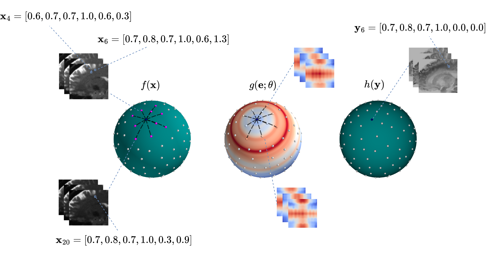

# Spatio-Angular Convolutions for Super-resolution in Diffusion MRI



[](https://badge.fury.io/py/dmri-pcconv)

This project performs angular super-resolution of dMRI data through a parametric continuous convolutional neural network (PCCNN). This codebase is associated with the following paper. Please cite the paper if you use this model:

[Spatio-Angular Convolutions for Super-resolution in Diffusion MRI](https://arxiv.org/abs/2306.00854) [NeurIPS 2023]

## Table of contents

* [Installation](#installation)
* [Training](#training)
* [Prediction](#prediction)

## Installation

`dmri-pcconv` can be installed via pip:

```bash
pip install dmri-pcconv
```

### Requirements

`dmri-pcconv` uses [PyTorch](https://pytorch.org/) as the deep learning framework.

Listed below are the requirements for this package, these will automatically be installed when installing via pip.

* `torch`
* `lightning`
* `npy-patcher`
* `einops`
* `nibabel`

## Training

Follow the instructions below on how to train a PCCNN model for dMRI angular super-resolution.

### Data Preprocessing

This training pipeline requires `dMRI` data to be saved in `.npy` format. Additionally, the angular dimension must be the first dimension within each 4D array. This is because this module uses [npy-patcher](https://github.com/m-lyon/npy-cpp-patches) to extract training patches at runtime. Below is an example of how to convert `NIfTI` files into `.npy` using [nibabel](https://nipy.org/nibabel/).

```python
import numpy as np

from dmri_pcconv.core.io import load_nifti

data, _ = load_nifti('/path/to/data.nii.gz')  # Load dMRI data into memory
data = data.transpose(3, 0, 1, 2)  # Move the angular dimension from last to first
data = data if data.flags['C_CONTIGUOUS'] else data.copy(order='C')  # Ensure data is in C-contiguous format.
np.save('/path/to/data.npy', data, allow_pickle=False)  # Save in npy format. Ensure this is on an SSD.
```

**N.B.** *Patches are read lazily from disk, therefore it is **highly** recommended to store the training data on an SSD type device, as an HDD will significantly bottleneck the training process when data loading.*

**N.B.** *Numpy data needs to have C-contiguous memory ordering to be used by the `npy-patcher` module during training.*

Additionally, `xmax` values are required prior to training, due to the lazy runtime of data extraction mentioned above. Below is an example of how to extract and save `xmax` values for a given subject.

```python
from dmri_pcconv.core.io import load_bval, load_nifti
from dmri_pcconv.core.normalisation import TrainingNormaliser

bvals = load_bval('path/to/bvals')
dmri, _ = load_nifti('/path/to/dmri.nii.gz')
mask, _ = load_nifti('/path/to/brain_mask.nii.gz')

xmax_dict = TrainingNormaliser.calculate_xmax(dmri, bvals, mask)
TrainingNormaliser.save_xmax('/path/to/xmax.json', xmax_dict)
```

### Example

Below is an example of how to train the `PCCNN` model, it uses the `lightning` module `PCCNNLightningModel` and data module `PCCNNDataModule`. The `PCCNN-Bv`, `PCCNN-Sp`, and `PCCNN-Bv-Sp` variants all have their own corresponding model and data module classes.

```python
import lightning.pytorch as pl

from dmri_pcconv.core.qspace import QSpaceInfo
from dmri_pcconv.core.model import PCCNNLightningModel
from dmri_pcconv.core.training import Subject, PCCNNDataModule

# Collect dataset filepaths
subj1 = Subject(
    '/path/to/first/dmri.npy',
    '/path/to/first/bvecs',
    '/path/to/first/bvals',
    '/path/to/first/brain_mask.nii.gz',
    '/path/to/first/xmax.json'
)
subj2 = Subject(
    '/path/to/second/dmri.npy',
    '/path/to/second/bvecs',
    '/path/to/second/bvals',
    '/path/to/second/brain_mask.nii.gz',
    '/path/to/second/xmax.json'
)
subj3 = Subject(
    '/path/to/third/dmri.npy',
    '/path/to/third/bvecs',
    '/path/to/third/bvals',
    '/path/to/third/brain_mask.nii.gz',
    '/path/to/third/xmax.json'
)

# Assign Q-space training parameters
qinfo = QSpaceInfo(
    q_in_min=6, # Minimum number of q-space samples each training example will hold
    q_in_max=20  # Maximum number. Training will sample in between this range.
    q_out=10  # Number of output samples per training example.
    shells=(1000, 2000, 3000)  # Shells used in training and prediction.
    seed=12345  # Optionally provide a random seed for sampling
)

# Create DataModule instance. This is a thin wrapper around `pl.LightningDataModule`.
data_module = PCCNNDataModule(
    train_subjects=(subj1, subj2),
    val_subjects=(subj3),
    qinfo=qinfo,
    batch_size=16, # Batch size of each device
    num_workers=8, # Number of CPU workers that load the data
    seed=12345, # Optionally provide a random seed for sampling
)

# Load PCCNN lightning model
model = PCCNNLightningModel()

# Create `pl.Trainer` instance. `PCCNNDataModule` is usable in DDP distributed training strategy.
trainer = pl.Trainer(devices=1, accelerator='gpu', epochs=100)

# Start training
trainer.fit(model, data_module)
```

**N.B.** *Each training **input** consists of one shell (randomly sampled from the `shells` argument to `QSpaceInfo`) of size `q_in` where `q_in` is randomly sampled from a range between `q_in_min` and `q_in_max`. Each training **output** consists of one shell (again, randomly sampled from the `shells` argument) of size `q_out`.*

## Prediction

Here we outline how to perform prediction after training.

```python
import torch

from dmri_pcconv.core.weights import get_weights
from dmri_pcconv.core.model import PCCNNBvLightningModel
from dmri_pcconv.core.prediction import PCCNNBvPredictionProcessor

# Load your pretrained weights

## From the original paper
weights = torch.load(get_weights('pccnn-bv'))
model = PCCNNBvLightningModel()
model.load_state_dict(weights)

## Or from a pytorch_lightning checkpoint
model = PCCNNBvLightningModel.load_from_checkpoint('/path/to/my/checkpoint.ckpt')

# Run prediction
predict = PCCNNBvPredictionProcessor(batch_size=4, num_workers=8, accelerator='gpu')
predict.run_subject(
    model=model,
    dmri_in='/path/to/context_dmri.nii.gz',
    bvec_in='/path/to/context_bvecs',
    bval_in='/path/to/context_bvals',
    bvec_out='/path/to/target_bvecs',
    bval_out='/path/to/target_bvals',
    mask='/path/to/brain_mask.nii.gz',
    out_fpath='/path/to/predicted_dmri.nii.gz',
)
```

**N.B.** *Weights provided by the `get_weights` function are saved within `~/.dmri_pcconv` by default. Set `DMRI_PCCONV_DIR` environment variable to override the save directory.*
